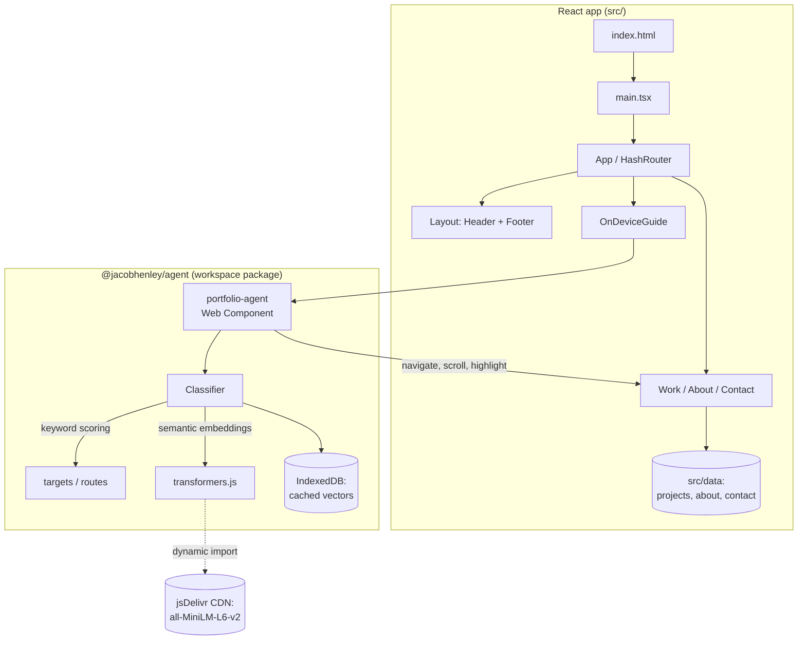
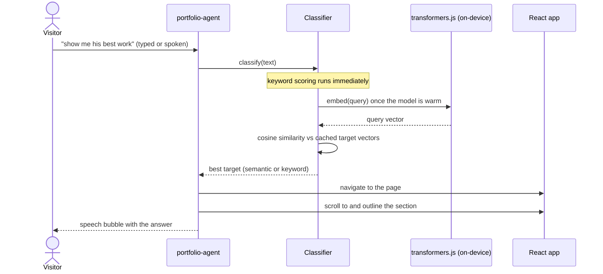

# jacobhenley.com

Personal portfolio for Jacob Henley, built as a static React single-page app and deployed to GitHub Pages. Beyond the usual work, about, and contact pages, the site ships an **on-device guide agent**: an animated assistant that runs a small language model directly in the browser, interprets a visitor's question in plain language, and walks them to the relevant part of the site.

**Live:** https://jhenley1219.github.io/jacobhenley/

## Stack

- **React 19 + TypeScript**, bundled with **Vite 6**
- **react-router** (HashRouter) for client-side routing that survives deep links and refreshes on GitHub Pages
- **CSS Modules** for component-scoped styling, with no UI framework
- **transformers.js** for in-browser semantic search, loaded on demand and cached locally
- **npm workspaces** monorepo: the guide agent lives in its own package and depends on nothing from the app

## Repository layout

```
.
├── index.html
├── public/
│   ├── images/                 project and profile imagery
│   ├── videos/                 short project clips
│   └── favicon.svg
├── src/
│   ├── components/             Header, Footer, cards, modal, Axle visuals
│   ├── pages/                  WorkPage, AboutPage, ContactPage
│   ├── data/                   typed site content (projects, about, contact)
│   ├── styles/                 global.css
│   ├── App.tsx                 routes + mounts the guide
│   └── main.tsx                entry point
├── packages/
│   └── agent/                  @jacobhenley/agent: the on-device guide
│       └── src/                PortfolioAgent, Classifier, targets, routes, idb
└── .github/workflows/          GitHub Pages deploy
```

## Architecture

The app is a thin, content-driven SPA. All copy lives in typed `src/data` modules, pages render from that data, and the guide agent is a self-contained package the app mounts once at the document root.



## The on-device guide agent

The agent (`packages/agent`) is the centerpiece. It is a framework-agnostic Web Component (`<portfolio-agent>`) rendered into its own shadow DOM, with a small React wrapper (`OnDeviceGuide`) that mounts it and forwards router navigation.

A visitor can type or speak a question. Intent matching runs entirely in the browser:

1. A **keyword pass** scores the query against each target's example phrases and runs instantly, so the agent is useful before any model loads.
2. On first interaction the agent warms up a quantized **all-MiniLM-L6-v2** sentence-embedding model, pulled on demand from a pinned jsDelivr build of transformers.js. Target embeddings are computed once and cached in **IndexedDB**, so later visits skip the work.
3. When the model is ready, the query is embedded and compared to the cached target vectors by cosine similarity. Keyword results win when the semantic score is weak, which keeps obvious matches stable.

The matched target then drives the UI: the agent navigates to the right page, smooth-scrolls to the section, outlines it, and surfaces a short answer. If the model fails to load or the browser lacks speech support, it degrades gracefully to keyword matching and text input.



The intent classifier is covered by a test suite (`packages/agent/src/Classifier.test.ts`) that exercises a large bank of realistic recruiter questions and checks both routing accuracy and out-of-scope rejection.

## Local development

```bash
npm install        # install workspace dependencies
npm run dev        # start the Vite dev server
npm run build      # type-check, then build to dist/
npm run typecheck  # tsc with no emit
npm test           # run the vitest suite
```

## Deployment

Pushing to `main` triggers `.github/workflows/deploy.yml`, which builds the app and publishes `dist/` to GitHub Pages via the official Pages actions. The Vite `base` is relative and routing uses `HashRouter`, so the build works at a project subpath or a custom domain with no server-side configuration.
```
